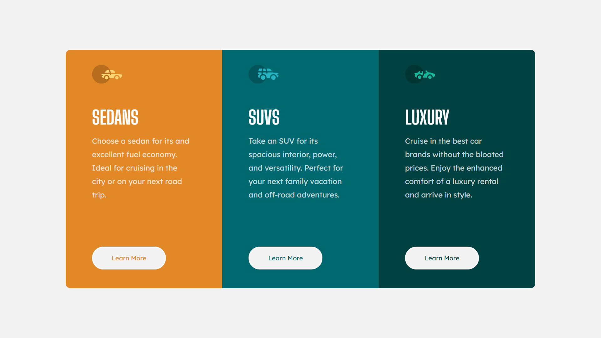

# Frontend Mentor - 3-column preview card component

This is a solution to the [Stats preview card component challenge on Frontend Mentor](https://www.frontendmentor.io/challenges/3column-preview-card-component-pH92eAR2-).  

## Table of contents

- [Overview](#overview)
  - [The challenge](#the-challenge)
  - [Screenshot](#screenshot)
  - [Links](#links)
- [My process](#my-process)
  - [Built with](#built-with)
  - [What I learned](#what-i-learned)

## Overview

### The challenge

Users should be able to:

- View the optimal layout depending on their device's screen size

### Screenshot

### Links

- Live Site URL:

## My process

- Secondly do practice by using HTML and CSS 
- Practice using with box-sizing more 
- Practice using grid layout
- enhacing and fixing coding structure in css 
- learning to firgure out solution for using padding

### Built with

- HTML
- CSS (Flexbox)

### What I learned
Get to know with using flexbox,doing as a practical project to enhance knowledge and getting insights about css structures.

